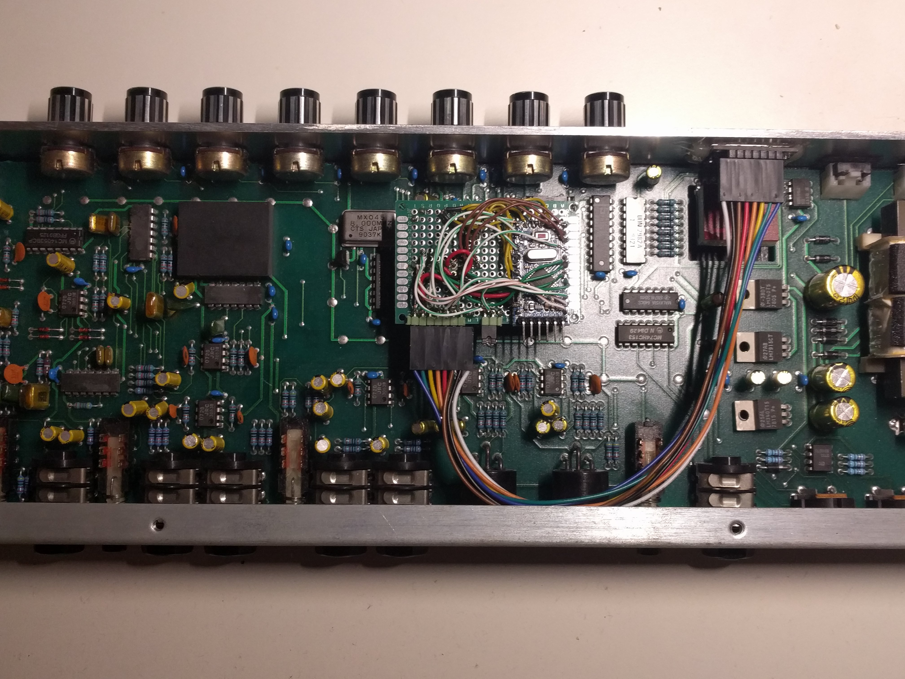
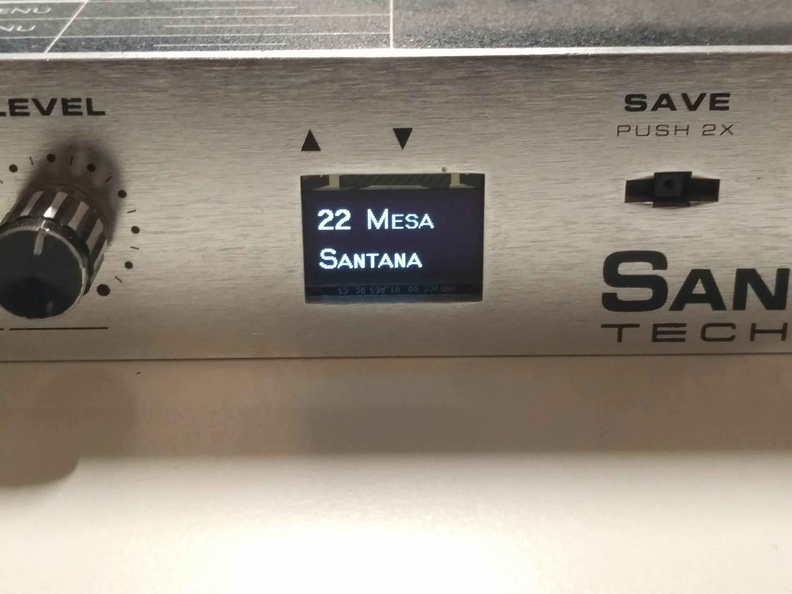

# sansamp-arduino
Arduino replacement for the digital innards of the original SansAmp PSA-1 guitar pre-amplifier.

The ROM in my SansAmp got corrupted, so I built this contraption from an Arduino Pro Mini and an OLED display. It plugs into the PLCC socket, replacing the MC68HC11 processor.

The OLED mod is reversible, as the original 7-segment display is just bent down (the glue broke on my unit anyway).

## TODO

- MIDI support
- Proper PCB
